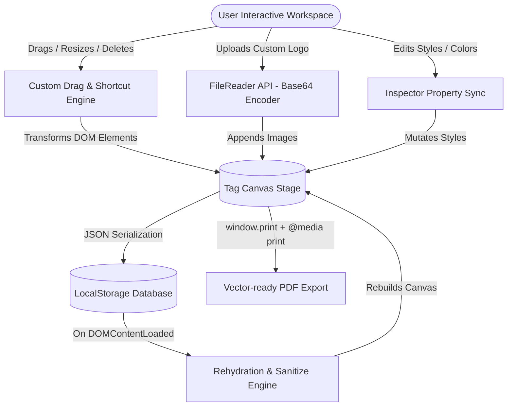

# 🏷️ TagStudio — Pro Clothing Label & Sticker Designer

<p align="center">
  
  
  
  
</p>

---

**TagStudio** is a premium, zero-dependency browser-based workspace engineered for fashion brands and clothing manufacturers. It offers an interactive dashboard to dynamically design, preview, persist, and export manufacturing-ready product tags, neck labels, and square stickers. 

Built with **100% Vanilla JavaScript (No Frameworks, No Libraries)**, the application leverages raw browser APIs and modern CSS3 features to create a polished macOS/desktop-like professional workspace.

---

## 🚀 Key Highlights & Technical Accomplishments

> [!TIP]
> **Performance First**: By avoiding bulky canvas frameworks (like Fabric.js) and using native DOM nodes, TagStudio delivers fluid **60fps dragging** and pixel-perfect native PDF vector output.

### 📐 1. Dynamic DOM Manipulation
- **Runtime Generation**: Dynamic creation and injection of text layers, high-fidelity barcodes, and uploaded image logos using `document.createElement`.
- **Inspector Data-Binding**: Two-way data binding syncs properties (fonts, colors, sizes) in real-time between the canvas elements and the context-sensitive Frosted Glass inspector.
- **Smart Bounds Recovery**: Auto-scales and shifts elements safely back into bounds during live shape transitions (e.g., switching from horizontal Neck Label to Vertical Hang Tag).

### 🎛️ 2. Custom Physics & Drag Engine
- **Offset Math Physics**: A custom-engineered mouse tracker that computes pointer relative offsets (`clientX`/`clientY` vs `BoundingClientRect`) for drag physics.
- **Strict Boundary Constraints**: Prevents design elements from being dragged outside of the printable canvas, keeping layouts clean and organized.
- **Workspace-wide Gestures**: Responsive grid-click handling for quick deselection and global shortcuts (`Delete` or `Backspace`) to clean up layouts in one tap.

### 💾 3. Persistence & Rehydration Architecture
- **Canvas JSON Serialization**: Elements, absolute position percentages, typography styles, and image asset sources are packed into structured JSON.
- **State Rehydration**: Automatically reads, sanitizes, and parses state payload from `LocalStorage` on load, populating the editor with the last-modified workspace state.
- **Robust Color Sanitization**: Gracefully maps transparent/alpha-channel browser computed canvas backgrounds to correct solid Hex values, protecting inputs from parsing errors.

### 📄 4. Native Device Integration
- **FileReader API**: Processes locally uploaded logos into base64 DataURLs asynchronously, embedding custom branding directly into the document DOM.
- **Native PDF Printing API**: Uses `window.print()` mapped with modern print CSS directives (`@media print`) to hide UI layouts and produce high-resolution, vector-ready PDF tags.

---

## 🗺️ System Architecture

The following diagram details how TagStudio bridges user interaction, data persistence, and native devices without a single external library:



---

## 📂 Project Structure

| File | Type | Architecture / Design Role |
| :--- | :--- | :--- |
| **`index.html`** | Structure | Semantic HTML5 structure. Builds the macOS frosted sidebar, canvas container, and context-sensitive inspector panel. |
| **`style.css`** | Styling | Vanilla CSS3. Implements **Glassmorphism** (`backdrop-filter`), custom shadows, grid lines, and high-fidelity CSS barcode vectors. |
| **`script.js`** | Logic | Core workspace driver. Holds state coordinates, manages element selection, handles dragging boundaries, and runs storage operations. |
| **`README.md`** | Documentation | World-class guide detailing features, architecture, and manual setup. |

---

## 🛠️ How to Run Locally

Because TagStudio requires zero packages, compiling, or dependencies, setting it up takes only seconds.

### Method 1: The Zero-Install Way
1. Clone or download this repository.
2. Double-click the **`index.html`** file in your local file explorer.
3. The app launches immediately inside your default web browser.

### Method 2: Development Mode (Recommended)
Running through a local development server ensures dynamic assets load perfectly:
1. Open the project directory in **VS Code**.
2. Install the **Live Server** extension.
3. Click **"Go Live"** in your status bar or right-click `index.html` and select **"Open with Live Server"**.

---

## 📋 Comprehensive Usage Guide

```
┌────────────────────────────────────────────────────────┐
│  1. SELECT TAG SHAPE ──► Hangtag / Necklabel / Sticker │
├────────────────────────────────────────────────────────┤
│  2. INSERT ELEMENTS ──► Text / Custom Logos / Barcodes  │
├────────────────────────────────────────────────────────┤
│  3. CONTEXT EDITING ──► Scale, Style & Delete Items     │
├────────────────────────────────────────────────────────┤
│  4. PERSIST DESIGN  ──► Save instantly to LocalStorage │
├────────────────────────────────────────────────────────┤
│  5. VECTOR EXPORT   ──► Print-to-PDF vector sheets     │
└────────────────────────────────────────────────────────┘
```

1. **Tag Setup**: Use the **Shape & Type** select menu in the sidebar to switch dimensions instantly. Customize the material background color using the **Tag Color** picker.
2. **Dynamic Dragging**: Drag items anywhere inside the workspace. The boundary protection rules will seamlessly prevent items from slipping outside.
3. **Workspace Focus**:
   - **Click** any element to focus and edit its font size, families, color, or text content in the Sidebar Inspector.
   - **Click the Grid** (outside the tag) to instantly deselect and clear active bounds.
   - Press **`Backspace` / `Delete`** on your keyboard to instantly remove a focused element.
4. **Saving State**: Click **"Save Project"** to save your design to `LocalStorage`. It will stay saved even if you close the browser window.
5. **Vector Export**: Click **"Export PDF"** to open your native print dialog. In the print options, choose **"Save as PDF"** for vector-quality printable files.

---

> [!IMPORTANT]
> Built for the **Web Dev II End Term Project (Batch 2029)**. Fully compliant with all specifications, including custom DOM mutations, event handling, state serialization, and offline storage.
